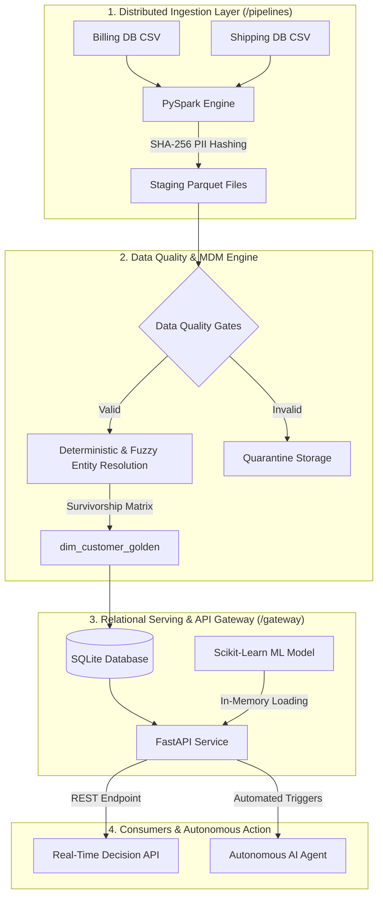

#  Enterprise Data Platform: MDM, Governance & Real-Time ML Gateway

An enterprise-grade, end-to-end data architecture platform that ingests multi-source transactional datasets, applies SHA-256 PII masking, resolves customer identities into an authoritative **Master Data Management (MDM) Golden Record**, and serves real-time machine learning predictions via a FastAPI Gateway.

---

##  Executive Architecture Blueprint

## Key Features & Architectural Highlights
Distributed PySpark Ingestion: Ingests and transforms multi-source operational records using distributed PySpark DataFrames.
Cryptographic PII Governance: Enforces SHA-256 cryptographic hashing (sha2) on sensitive identifiers (emails) prior to persistence, adhering to GOVERNANCE.md compliance policies.
Automated Quality Quarantine: Evaluates schema assertions (PK uniqueness, string length domain bounds) and routes corrupted data into isolated quarantine storage.
MDM & Entity Resolution: Executes deterministic matching on identity anchors (email_hash) and applies system-trust Survivorship Rules to create an authoritative Golden Record.
Low-Latency REST Gateway: Serves customer profiles and features via a FastAPI service with automated OpenAPI/Swagger interactive documentation.
Real-Time ML Decisioning: Features an in-memory Scikit-Learn Random Forest model that evaluates customer feature vectors and returns instant prediction probabilities.
Autonomous Action Agent: Consumes API routes to automate downstream business workflows (e.g., loyalty webhooks) based on model decision outputs.

##  Repository Structure
enterprise-data-platform/
├── docs/                   # System Architecture, Governance, & ERD Data Models
│   ├── ARCHITECTURE.md
│   ├── GOVERNANCE.md
│   └── DATA_MODEL.md
├── infrastructure/         # Relational Schema DDL & Database Loaders
│   ├── schema.sql
│   ├── load_db.py
│   └── enterprise_data.db
├── pipelines/              # PySpark ETL, Quality Gates, MDM, & Orchestration
│   ├── generate_data.py
│   ├── ingest_pyspark.py
│   ├── data_quality.py
│   ├── entity_resolution.py
│   └── orchestrator.py
├── gateway/                # REST API Service & Autonomous AI Agent
│   ├── app.py
│   └── agent_action.py
├── models/                 # Feature Engineering & ML Model Training
│   ├── train_model.py
│   └── customer_model.joblib
└── README.md               # Master Repository Documentation
